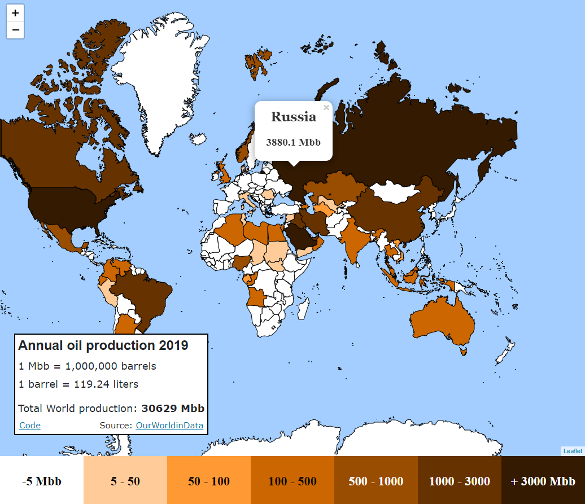

## Web map using React Leaflet, React Hooks, GeoJson and Papa Parse.

Web:

[https://josepansabate.github.io/React-Leaflet-World-Oil-Production-Deployment/](https://josepansabate.github.io/React-Leaflet-World-Oil-Production-Deployment/)

Font: 
[https://ourworldindata.org/grapher/oil-production-by-country](https://ourworldindata.org/grapher/oil-production-by-country)

Update:
npm run deploy 